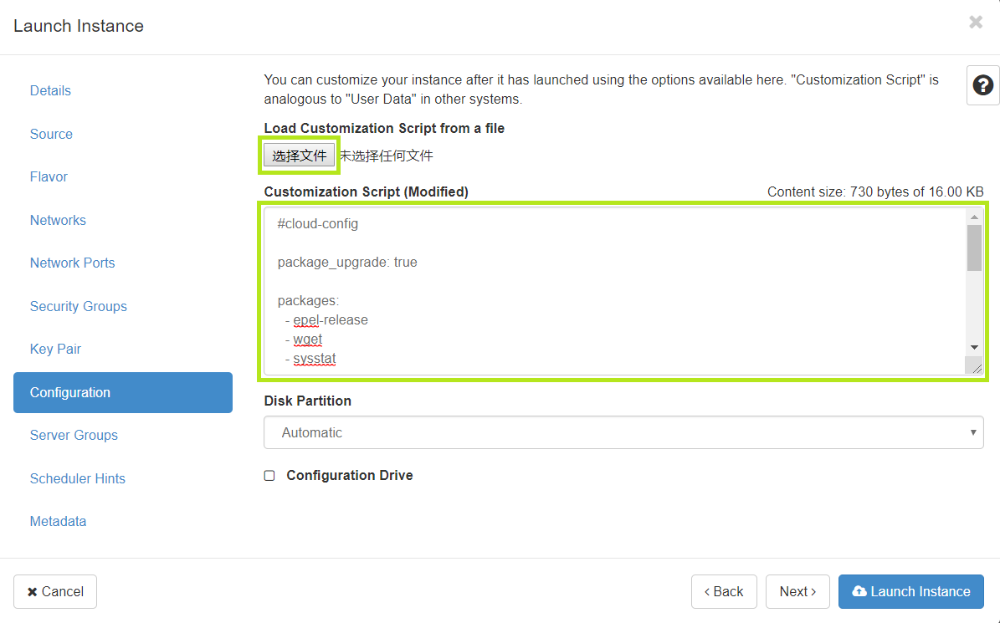

## 使用cloud-init脚本客户化OpenStack实例


### OpenStack镜像要求

在[OpenStack](https://en.wikipedia.org/wiki/OpenStack "OpenStack")计算云里如果Linux镜像要获得计算云所有功能，即镜像与计算云完美接口，则镜像需满足如下[要求](https://docs.openstack.org/image-guide/openstack-images.html "镜像要求")：
- 引导时可自动分区磁盘，自动调整根分区大小
- MAC地址不能被硬编码，即不能被写死
- SSH服务自动运行
- 禁止防火墙服务
- 实例创建后能通过ssh公钥访问
- 能处理用户数据（User Data）和其他元数据（Metadata）
- Linux内核具有泛虚拟化的Xen支持


### 实例客户化

[制作](https://docs.openstack.org/image-guide/create-images-automatically.html "制作镜像方法")一个完全符合OpenStack要求的镜像，其过程稍有些复杂，且测试耗时。如果想通过镜像发布自己的应用以用于OpenStack计算云或者通过镜像创建实例后做一些自动化操作，比如升级系统，安装软件包，更新时区，创建用户等，一个可选的方法是利用OpenStack已制作好且完全符合要求的[镜像](https://docs.openstack.org/image-guide/obtain-images.html "OpenStack提供的镜像")，在创建实例时注入编写好的客户化脚本，然后由[Cloud-Init](https://cloudinit.readthedocs.io/en/latest/ "Cloud-Init的具体描述")来完成实例的客户化工作。

如下图绿色方框所示，在OpenStack的实例(即虚拟机)创建页面，点击第一个方框内按钮后从本地文件读入客户化脚本，并放到第二个绿色方框内，也可以直接把客户化脚本粘贴到第二个绿色方框内。客户化脚本有大小限制，不能超过16KB，但足以满足普通需求了。



### 客户化脚本

实例的客户化脚本，在OpenStack里就是用户数据(User Data)，使用[YAML](https://en.wikipedia.org/wiki/YAML "YAML Ain't Markup Language")，在实例创建后第一次引导时由Cloud-Init解释执行。

本文基于OpenStack提供的CentOS和Ubuntu镜像创建实例为例介绍客户化脚本。

#### CentOS实例客户化脚本

下面脚本用于以CentOS镜像创建实例，其中修改authorized_keys的公钥部分，需要被替换为实际使用的公钥。
```
#cloud-config

package_upgrade: true

packages:
  - epel-release
  - wget
  - sysstat
  - screen

runcmd:
  - echo "$(hostname -I | cut -d' ' -f1)     $(hostname)" >> /etc/hosts
  - timedatectl set-timezone Asia/Shanghai
  - echo 'ssh-rsa AAAAB3NzaC1yc2EAAAADAQABAAABAQC80BXYkBhBn5u33iAWNMziclxGm8bZKP4aSFZHLzslWn/qaY02g28N7MhCz8GGfxkCbigXchr8ReXnIEpIn0L2JQqGtXX8Bv3PoUzIiZ5MCD1YDNIdXnt0NVAzOrArFaMYyD3QoFzoiG42DjBcSUFmQjstEft+e5BDnbMOr9fxX5cFUW87MQU3iErNLyNCqwmQNmZrmBBHcgyhiSrUmvDw3oXeqJtPjuXiXOPogWAFaAKil5NYNpCoPm+yF86I3SCTW5aatGXdqu/j42dXIew6wMo6nL7DAWp22Tp91Z1/ZAuJ9ClRHyGltPdz7IKFU0nshUW3dVBtv3OFf/XjW4Et test' >> /home/$(cat /etc/*release|grep -e "^ID="|tr -d '"'|awk -F"=" '{print tolower($2)}')/.ssh/authorized_keys   
  
```

脚本第一行”#cloud-config"，告诉Cloud-Init，本脚本是一个cloud-config文件。这与shell程序第一行有些相似，如：#! /bin/bash。

第二段代码"package_upgrade: true"，告诉Cloud-Init，在虚拟机第一次引导后需要更新或升级软件包。缺省不更新软件包。

第三段是一个安装包列表，说明系统第一次引导后需要安装的软件包。本例中需要安装的软件包分别是epel-release、wget、sysstat、screen。Cloud-Init会根据列表顺序安装软件包。

第四段是一个命令列表，说明系统第一次引导后需要运行的命令，列表项之间是相互独立的，且按顺序被Cloud-Init执行。解释如下：
- 第一条命令是设置主机名与地址的映射
- 第二条命令是设置系统时区为上海时区（即北京时区）
- 第三条命令添加用户的授权公钥，即可以通过ssh和设置的密钥对访问系统环境。OpenStack提供的CentOS镜像内置了用户centos，Ubuntu镜像内置的用户则是ubuntu。在OpenStack计算云里创建实例时会指定密钥对，这里再增加一个密钥对。


#### Ubuntu实例客户化脚本

下面脚本用于以Ubuntu镜像创建实例，其中修改authorized_keys的公钥部分，需要被替换为实际使用的公钥。
```
#cloud-config

package_upgrade: true

packages:
  - wget
  - sysstat
  - screen

runcmd:
  - echo "$(hostname -I | cut -d' ' -f1)     $(hostname)" >> /etc/hosts
  - timedatectl set-timezone Asia/Shanghai
  - echo 'ssh-rsa AAAAB3NzaC1yc2EAAAADAQABAAABAQC80BXYkBhBn5u33iAWNMziclxGm8bZKP4aSFZHLzslWn/qaY02g28N7MhCz8GGfxkCbigXchr8ReXnIEpIn0L2JQqGtXX8Bv3PoUzIiZ5MCD1YDNIdXnt0NVAzOrArFaMYyD3QoFzoiG42DjBcSUFmQjstEft+e5BDnbMOr9fxX5cFUW87MQU3iErNLyNCqwmQNmZrmBBHcgyhiSrUmvDw3oXeqJtPjuXiXOPogWAFaAKil5NYNpCoPm+yF86I3SCTW5aatGXdqu/j42dXIew6wMo6nL7DAWp22Tp91Z1/ZAuJ9ClRHyGltPdz7IKFU0nshUW3dVBtv3OFf/XjW4Et test' >> /home/$(cat /etc/*release|grep -e "^ID="|tr -d '"'|awk -F"=" '{print tolower($2)}')/.ssh/authorized_keys   
 
```

上述脚本与以CentOS镜像创建实例的客户化脚本相似，除了第三段packages列表少了安装包epel-release，该包在ubuntu里不需要，不再赘述。

#### 查看客户化脚本

实例创建后，可通过putty或ssh登陆进入系统，使用如下命令查看实例客户化脚本:
```
curl http://169.254.169.254/latest/user-data  
```
结果来自于实例的用户数据(User Data)，与实例客户化脚本内容相同。

关于如何查看实例或虚拟机的用户数据和元数据信息，请访问[AWS实例元数据和用户数据](https://docs.aws.amazon.com/AWSEC2/latest/UserGuide/ec2-instance-metadata.html  "实例元数据和用户数据")


### 总结

通过客户化脚本可以方便地在OpenStack计算云里创建所需的实例。本文介绍了在OpenStack计算云中创建实例的客户化方法，简单实用。使用者可以根据需要编写自己的客户化脚本。关于Cloud-Init的详细信息，请访问[Cloud-Init文档](https://cloudinit.readthedocs.io/en/latest/ "Cloud-Init文档")。